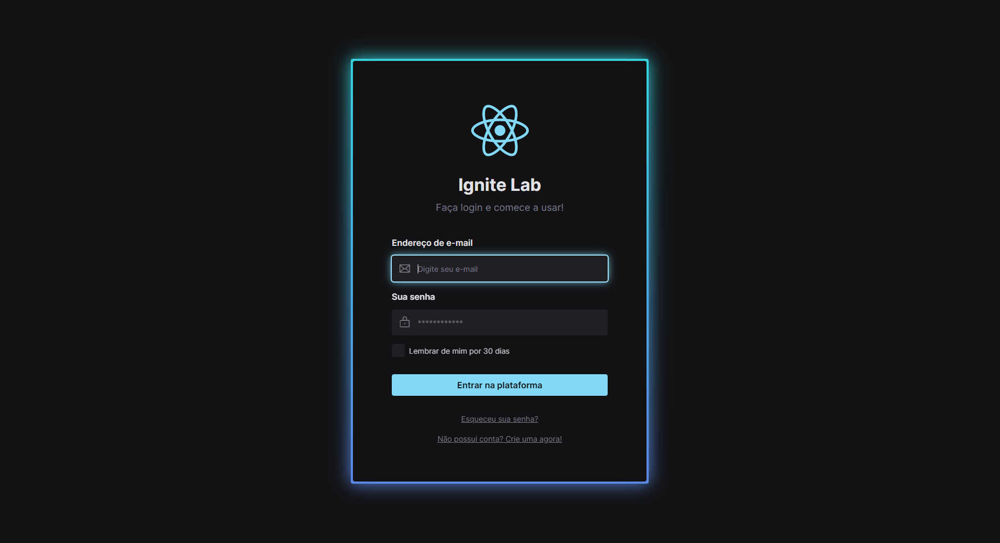
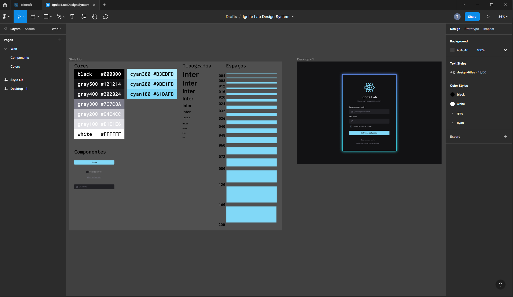
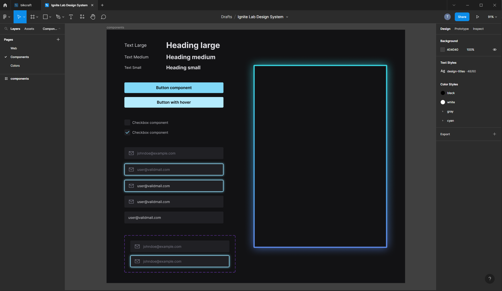
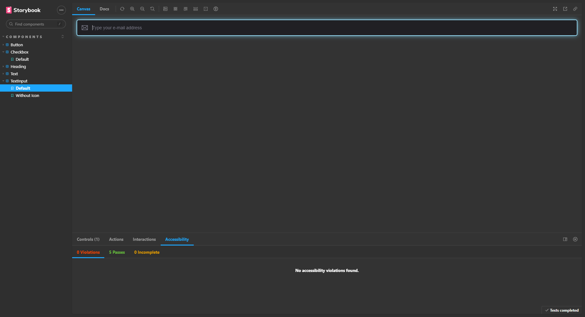

# Rocketseat - Ignite Lab Design System

This is a solution to the Ignite Lab Design System from Figma to React.

## A figma project was created to define the design system default components.

## Then the Storybook was configured to document all design system components.

# Built with

This project was built using the following technologies.

- React
- Tailwind
- Radix
- Storybook

# Links

## Storybook Deploy Link
https://tascintra.github.io/design-system-lab

## React Application Deploy Link
https://design-system-lab-tascintra.vercel.app

# Author

- LinkedIn: [linkedin.com/in/tascintra](https://www.linkedin.com/in/tascintra/)
- Frontend Mentor: [frontendmentor.io/profile/tascintra](https://www.frontendmentor.io/profile/tascintra)